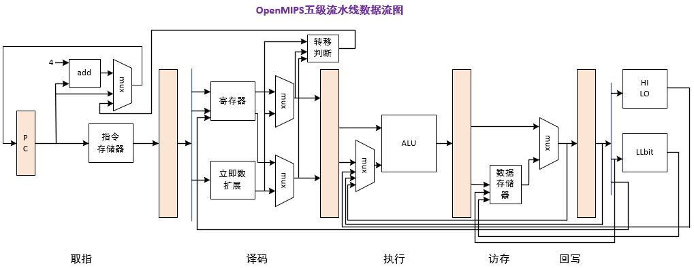
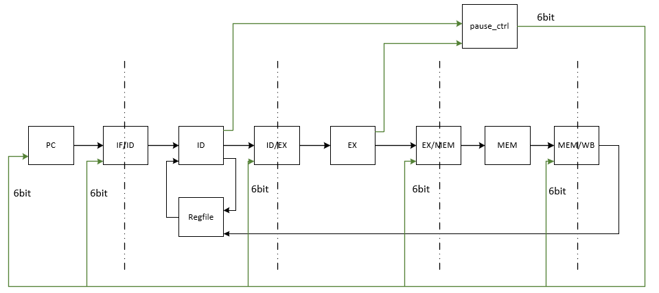

# OpenMIPS

## briey

本仓库是在学习《 自己动手写CPU 》( **./doc/自己动手写CPU.pdf** ) 这本书时，所做的代码记录。

原书系统结构和代码描述很清晰，但是代码风格略微有些混乱，因此学习过程中按照原书的思路使用SytemVerilog重新编写了代码。

代码目前经过了仿真测试，没有下板测试。

原书在实践版OpenMIPS的结构中使用了wishbone总线以及flash、sdram等，这里不打算使用这些，考虑后续使用axi总线、tf卡、ddr等进行替换。

仓库代码的v1.0.0版本实现了原书的教育版OpenMIPS。

仓库代码的最新版只是添加wishbone接口，且并没有连接外部模块，因此不可仿真测试。

## block diagram

系统结构框图如下: 

部分代码模块对应的结构如下: 

